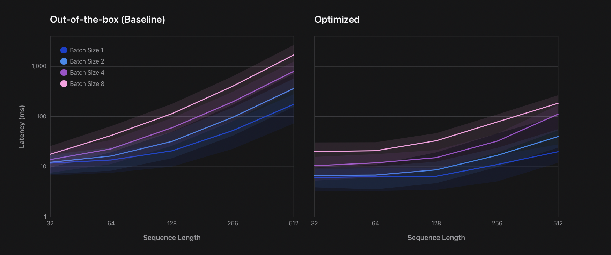
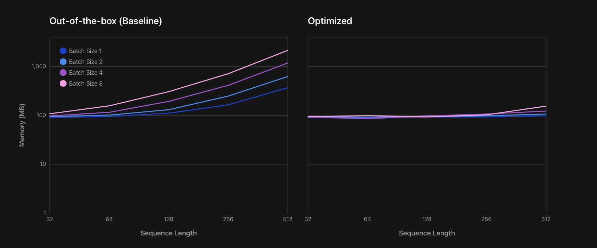
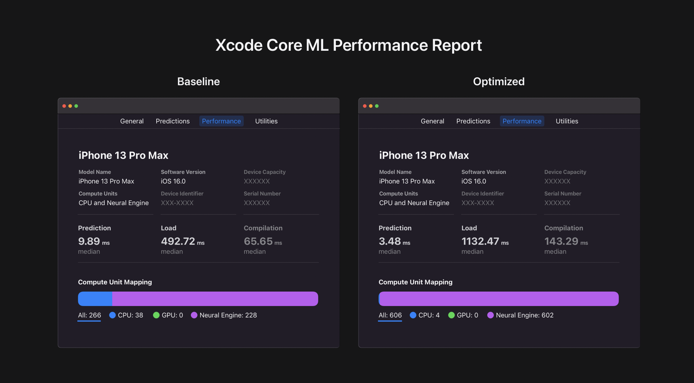

# Apple Neural Engine (ANE) Transformers
Use `ane_transformers` as a reference PyTorch implementation if you are considering deploying your Transformer models on Apple devices with an A14 or newer and M1 or newer chip to achieve up to **10 times faster** and **14 times** lower peak memory consumption compared to baseline implementations.

`ane_transformers.reference` comprises a standalone reference implementation and `ane_transformers.huggingface` comprises optimized versions of [Hugging Face](https://huggingface.co/models) model classes such as `distilbert` to demonstrate the application of the optimization principles laid out in our research article on existing third-party implementations.

Please check out our [research article](https://machinelearning.apple.com/research/apple-neural-engine) for a detailed explanation of the optimizations as well as interactive figures to explore latency and peak memory consumption data from our case study: [Hugging Face distilbert](https://huggingface.co/distilbert-base-uncased-finetuned-sst-2-english) model deployment on various devices and operating system versions. Below figures are non-interactive snapshots from the research article for iPhone 13 with iOS16.0 installed:





## Tutorial: Optimized Deployment of Hugging Face distilbert

This tutorial is a step-by-step guide to the model deployment process from the case study in our research article. The same code is used to generate the Hugging Face distilbert performance data in the figures above.

In order to begin the optimizations, we initialize the baseline model as follows:

```python
import transformers
model_name = "distilbert-base-uncased-finetuned-sst-2-english"
baseline_model = transformers.AutoModelForSequenceClassification.from_pretrained(
    model_name,
    return_dict=False,
    torchscript=True,
).eval()
```

Then we initialize the mathematically equivalent but optimized model, and we restore its parameters using that of the baseline model:

```python
from ane_transformers.huggingface import distilbert as ane_distilbert
optimized_model = ane_distilbert.DistilBertForSequenceClassification(
    baseline_model.config).eval()
optimized_model.load_state_dict(baseline_model.state_dict())
```

Next we create sample inputs for the model:

```python
tokenizer = transformers.AutoTokenizer.from_pretrained(model_name)
tokenized = tokenizer(
    ["Sample input text to trace the model"],
    return_tensors="pt",
    max_length=128,  # token sequence length
    padding="max_length",
)
```

We then trace the optimized model to obtain the expected input format (Torchscript) for the coremltools conversion tool.

```python
import torch
traced_optimized_model = torch.jit.trace(
    optimized_model,
    (tokenized["input_ids"], tokenized["attention_mask"])
)
```

Finally, we use coremltools to generate the Core ML model package file and save it.

```python
import coremltools as ct
import numpy as np
ane_mlpackage_obj = ct.convert(
    traced_optimized_model,
    convert_to="mlprogram",
    inputs=[
        ct.TensorType(
                f"input_{name}",
                    shape=tensor.shape,
                    dtype=np.int32,
                ) for name, tensor in tokenized.items()
            ],
            compute_units=ct.ComputeUnit.ALL,
)
out_path = "HuggingFace_ane_transformers_distilbert_seqLen128_batchSize1.mlpackage"
ane_mlpackage_obj.save(out_path)
```

To verify performance, developers can now launch Xcode and simply add this model package file as a resource in their projects. After clicking on the Performance tab, the developer can generate a performance report on locally available devices, for example, on the Mac that is running Xcode or another Apple device that is connected to that Mac. The figure below shows a performance report generated for this model on an iPhone 13 Pro Max with iOS 16.0 installed.




Based on the figure above, the latency is improved by a factor of 2.84 times for the sequence length of 128 and batch size of 1 that were chosen for the tutorial. Higher sequence lengths, such as 512, and batch sizes, such as 8, will yield up to **10 times lower latency** and **14 times lower peak memory consumption**. Please refer to Figure 2 from our [research article](https://machinelearning.apple.com/research/apple-neural-engine) for detailed and interactive performance data.

Note that the load and compilation times increase due to the number of operations increasing in the optimized model but these are one-time costs and user experience will not be affected if the model is loaded asynchronously.

Note that 4 of the 606 operations in the optimized model are executed on the CPU. These are the embedding lookup related operations and they are more efficient to do on the CPU for this particular model configuration.

## A Note on Unit Tests
The unit tests measure, among other things, the ANE speed-up factor. Since the device spec for this reference implementation is M1 or newer chips for the Mac and A14 and newer chips for the iPhone and iPad, the speed-up unit tests will print a warning message if executed on devices outside of this spec. Even if the model is generated using an out of spec Mac, the model should work as expected on in-spec devices.

## Installation & Troubleshooting
- Fastest: `pip install ane_transformers`
- Locally editable: `pip install -e .`
- If installation fails with `ERROR: Failed building wheel for tokenizers` or `error: can't find Rust compiler`, please follow this [solution](https://github.com/huggingface/transformers/issues/2831#issuecomment-592724471)